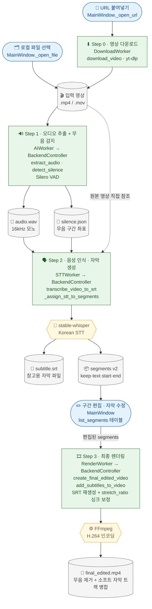
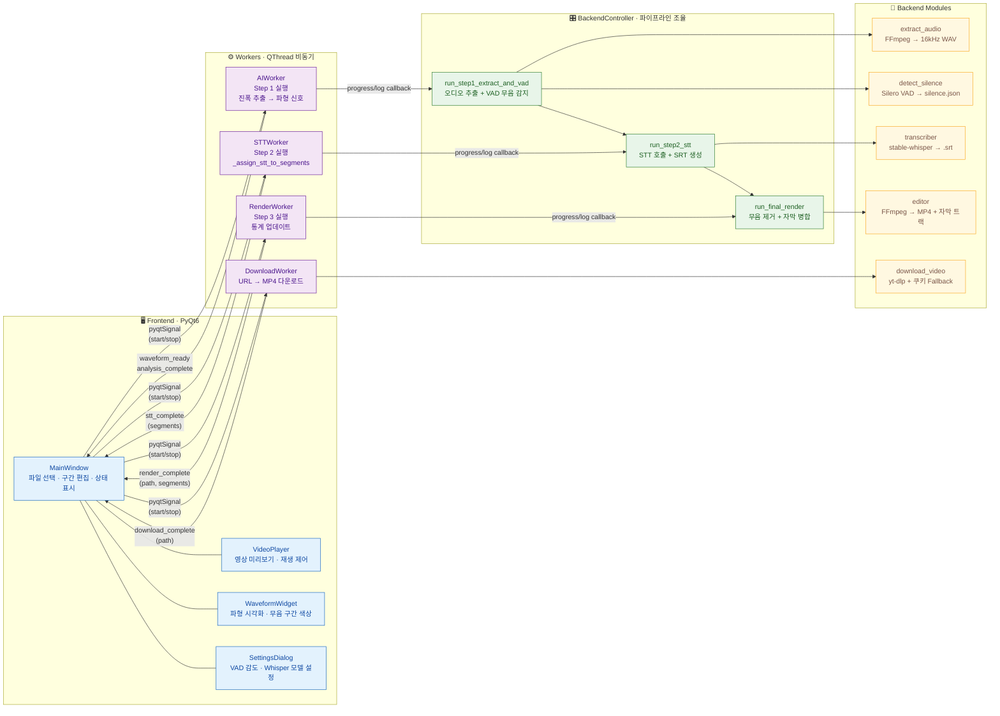

# SNAP-Editor 시스템 구성도

> **S**mart **N**eat **A**utomated **P**rocessing — 영상에서 무음 구간을 자동 제거하고 정밀 자막을 생성하는 AI 비디오 편집 도구

---

## 📋 사용 시나리오 흐름

사용자가 영상을 입력하고 최종 편집본을 얻기까지의 전체 흐름.  
각 단계에서 실제로 호출되는 컴포넌트와 핵심 처리를 함께 표시.



---

## 🏗 컴포넌트 레이어 구조

시스템을 4개 레이어로 분리하여 각 컴포넌트의 역할과 레이어 간 인터페이스를 표시.



---

## 📦 데이터 상태 변화

`segments` 객체가 각 파이프라인 단계를 거치며 어떻게 변화하는지 추적.

```mermaid
flowchart LR
    %% ── 원본 ──────────────────────────────────────────
    RAW[(🎬 원본 영상\n.mp4)]

    %% ── Step 1 산출 ───────────────────────────────────
    WAV[(🎵 audio.wav\n16kHz · 모노)]
    SEG1["📦 segments v1\nstart·end ms\nkeep True/False\ntext: 비어있음"]

    %% ── Step 2 산출 ───────────────────────────────────
    SEG2["📦 segments v2\nstart·end ms\nkeep True/False\ntext: STT 결과 채워짐\nwords: 단어별 타임스탬프"]

    %% ── 사용자 편집 ───────────────────────────────────
    SEG3["📦 segments v3\nstart·end ms  ← 수정 가능\nkeep True/False  ← 토글 가능\ntext: 수동 교정 가능"]

    %% ── 렌더링 입력 ───────────────────────────────────
    SILENCE["🔇 silence_segments\nkeep=False 구간만 추출\n단위: 초 변환"]

    %% ── 최종 출력 ─────────────────────────────────────
    FINAL[(🎉 final_edited.mp4\n소프트 자막 트랙 포함\n(mov_text 포맷))]

    %% ── 흐름 ──────────────────────────────────────────
    RAW -->|"extract_audio\n+detect_silence"| WAV
    WAV -->|"_convert_to_segments\nms 단위 교차 배치"| SEG1
    SEG1 -->|"transcribe_video_to_srt\n_assign_stt_to_segments"| SEG2
    SEG2 -->|"사용자 keep 토글\n자막 텍스트 수정"| SEG3
    SEG3 -->|"keep=False 필터링\n초 단위 변환"| SILENCE
    SILENCE -->|"create_final_edited_video\nadd_subtitles_to_video\n+ stretch_ratio 싱크 보정"| FINAL

    %% ── 스타일 ────────────────────────────────────────
    classDef fileNode fill:#F5F5F5,stroke:#757575,color:#424242
    classDef segNode  fill:#E8EAF6,stroke:#3949AB,color:#1A237E
    classDef userNode fill:#E3F2FD,stroke:#1565C0,color:#0D47A1,rx:10

    class RAW,WAV,FINAL fileNode
    class SEG1,SEG2,SILENCE segNode
    class SEG3 userNode
```

> **segments 핵심 필드**
>
> | 필드 | 타입 | 설명 |
> |---|---|---|
> | `start` | int (ms) | 구간 시작 시각 |
> | `end` | int (ms) | 구간 종료 시각 |
> | `keep` | bool | `True` = 보존(초록), `False` = 제거(빨강) |
> | `text` | str | STT 자막 텍스트 (Step 2 이후 채워짐) |
> | `words` | list | 단어별 타임스탬프 (불용어 강조에 사용) |

---

## ⚙ 기술 스택

| 레이어 | 기술 | 버전/비고 |
|---|---|---|
| **GUI** | PyQt6 | QMainWindow · QThread · pyqtSignal |
| **음성 인식 (STT)** | stable-whisper | Whisper 기반, 한국어 word timestamps |
| **무음 감지 (VAD)** | Silero VAD | torch.hub, 감도 0.0–1.0 조절 가능 |
| **영상 처리** | FFmpeg + ffmpeg-python | H.264 CRF 인코딩, 소프트 자막 트랙 |
| **다운로드** | yt-dlp | YouTube 403 우회 (android client + 쿠키 fallback) |
| **오디오 분석** | librosa · torchaudio | 16kHz 리샘플, RMS 진폭 추출 |
| **배포** | PyInstaller + static-ffmpeg | macOS .app 번들, frozen 환경 대응 |
